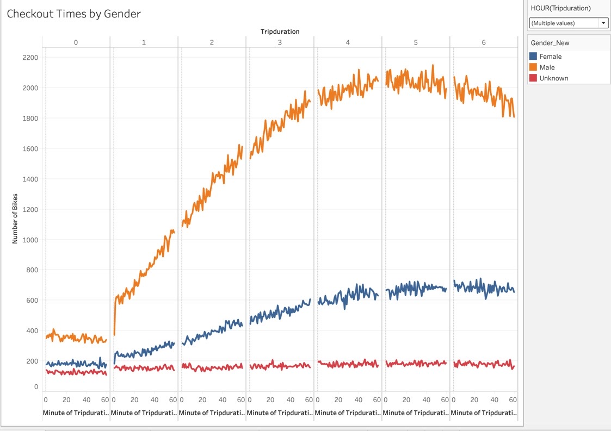

# bikesharing
## Overview of the statistical analysis:

The purpose of this module was to use Tableau to create compelling data stories to support easier business decisions. This module was very typical with how most businesses use large data with front end BI tools such as tableau. Tableau is very powerful and can create a compelling viz to help drive decisions.

## Overview of visualizations:
- The peak checkouttime based on the viz below shows that ~3000 bikes are checked out at roughly 5

- Males far outpace females when it comes to checking out bikes. Males roughly check out ~2100 bikes during the same time period mentioned above

- Mon, Tue, and Thurs are the busiest days for renting the bikes, specifically during the 5-6 pm hours which makes sense to accomodate for evening commute from work

- Similar as mentioned above, during that same period, Men are the heavy users for the bikes during the even rush commute for the same days

- Males tend to be subscribers to the service as opposed to just standard customers. The busiest day again appears to be Thursday

- Of the 2.3M trips, Males took approx 1.5M trips using the service

- The top starting locations for the bike service appears to be lower NYC.

## Summary

In conclusion, There is a high-level summary of the results and two additional visualizations are suggested for future analysis (5 pt)
